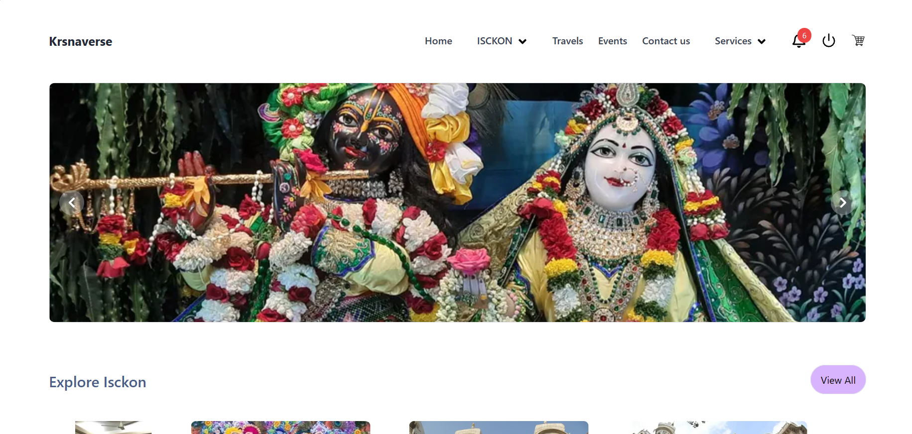
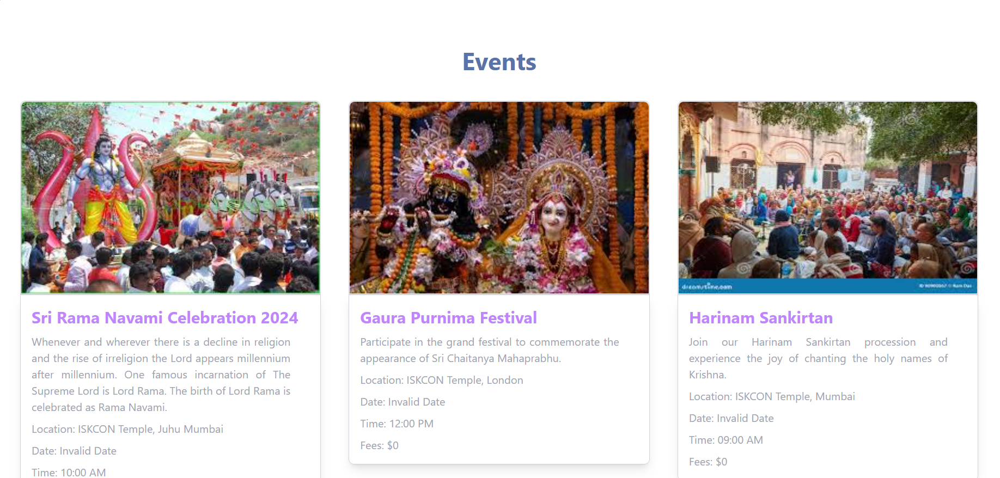
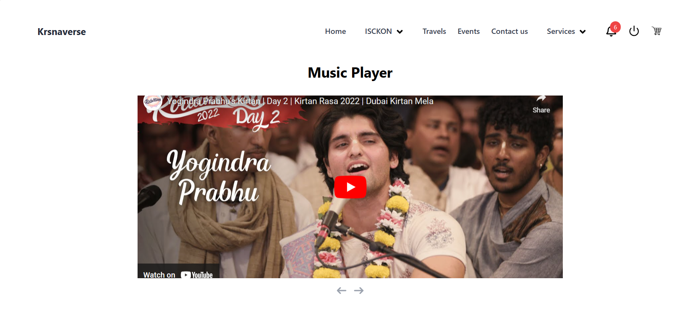

# Krsnaverse

Krsnaverse is a web application dedicated to spreading the teachings and consciousness of Lord Krishna, inspired by ISKCON (International Society for Krishna Consciousness). It aims to provide a platform for individuals to learn, explore, and engage with the philosophy, practices, and community of ISKCON.


## Table of Contents

- [About](#about)
- [Features](#features)
- [Team Members](#team-members)
- [Usage](#usage)

## About

Krsnaverse serves as a digital portal for individuals interested in understanding and experiencing the essence of Lord Krishna's teachings and the culture of ISKCON. Through various features and resources, it seeks to foster spiritual growth, community interaction, and personal development.


## Features

- **OTP Verification**: Secure user authentication and account verification through OTP (One-Time Password).
- **Events**: Explore and participate in ISKCON events, gatherings, and festivals.
- **Travel**: Discover and plan spiritual journeys and pilgrimages to sacred places related to Lord Krishna.
- **Purchase Books**: Browse, search, and buy books related to the philosophy, teachings, and literature of ISKCON.
- **Book Cart**: Manage and organize selected books for purchase with a user-friendly cart feature.
- **Dynamic Frontend**: Engage with a dynamic and interactive user interface that adapts to user preferences and actions.
- **Payment Gateway**: Securely process online payments for purchases and donations through integrated payment gateways.

## Screenshots








## Team Members

#### 1. Rishabh Jain
#### 2. Vipin Sharma
#### 3. Viren Makvana

## Usage
### Frontend
To start the frontend server, run:

```bash
cd frontend
npm start
```
### Backend
To start the backend server, run:

```bash
cd backend
nodemon app.js
```


